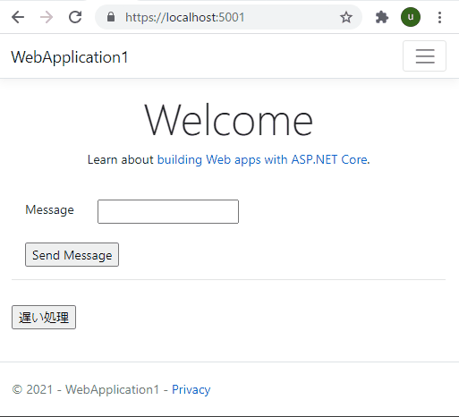

## サーバー側で遅い処理をしている場合に 進捗状況を表示する。

SignalR を使って、
下記のように 遅い時間のかかる処理を ユーザに進捗状況を表示しながら
バックグランドで処理を行う。

ログインしているユーザの ユーザID をグループ名にすることで 
特定のユーザにメッセージを送信する。

```
[HttpPost,ActionName("Index")]
        public IActionResult IndexPost()
        {
            string userGroup = this.HttpContext.User.Identity.Name;

            if (userGroup != null)
            {
                UserHubSignalR personSignal = new UserHubSignalR(Request, userGroup);

                // 遅い処理をバックグラウンドで実行させる
                Queue.QueueBackgroundWorkItem(async token =>
                {
                    await personSignal.SendMessageAsync("開始しました");

                    await Task.Delay(1000);
                    // ユーザに非同期で通知
                    await personSignal.SendMessageAsync(".. A ..");

                    await Task.Delay(1000);
                    await personSignal.SendMessageAsync(".. B ..");

                    await Task.Delay(1500);

                    // ユーザに非同期で通知
                    await personSignal.SendMessageAsync("完了しました");

                    // 完了通知
                    await personSignal.SendClientFinishMessageAsync();
                });
            }
            

            return View();
        }
```




## 利用している技術

SignalR で リアルタイムに 通知データを表示する方法

ASP.NET で バックグラウンドで 処理を行う方法

サーバー側から SignalR で ユーザに通知処理を行うための方法

### SignalR 用の サーバー側のエントリポイント追加

```
Hubs\UserHub.cs 
     SingalR の サーバー側の処理が実装されている。
```

```
Startup.cs ファイルに SignalR の動作定義追加
            // SignalR 定義追加
            services.AddSignalR();

                // SignalR の エンドポイント追加
                endpoints.MapHub<UserHub>(UserHub.EndPoint_URL);
```

実装部分詳細

https://github.com/kkato233/sample-singalR-UserHub/commit/59830b205acc6f72f2d4c0992934ae715d99aa2c#diff-21b431d8d52b7b53ee9e5214d52c03cc34392d5ee71f5aac292d4fad90487715

### クライアント側で SignalR による リアルタイム送信する JavaScript の例

クライアント側のライブラリとして
```
libman.json 

"defaultProvider": "cdnjs",
  "libraries": [
    {
      "library": "microsoft-signalr@5.0.2",
      "destination": "wwwroot/lib/microsoft-signalr/"
    }
```
を追加

SignalR の WEB サイト側の処理を記述する。

``` js
@section Scripts {
    <script src="~/lib/microsoft-signalr/signalr.min.js"></script>
    <script type="text/javascript">
        // SignalR 接続先
        var connection = new signalR.HubConnectionBuilder().withUrl("/UserHub").build();
        // メッセージ受信時の処理
        connection.on("ReceiveMessage", function (message) {
            // 受信したメッセージの表示
            console.log("ReceiveMessage:" + message);
            $("<li />").appendTo("#messagesList").text(message);
        });
        // 終了メッセージ受信時の処理
        connection.on("ReceiveFinishMessage", function () {
            console.log("ReceiveFinishMessage");
        });
        var userGroup = $("#userGroup").val();
        // SignalR 受信処理を開始
        connection.start().then(function () {
            if (userGroup) {
                // グループに参加
                connection.invoke("AddToGroup", userGroup).catch(function (err) {
                    return console.error(err.toString());
                });
            }
        }).catch(function (err) {
            return console.error(err.toString());
        });
        // クライアントによる 情報の通知
        if (userGroup) {
            $("#sendButton").click(function () {
                var message = $("#messageInput").val();
                connection.invoke("SendClientMessage", userGroup, message).catch(function (err) {
                    return console.error(err.toString());
                });
            });
        } else {
            $("#sendButton").prop("disabled", true);
        }
    </script>
```

ボタンと メッセージ表示領域を追加する。

### サーバー側で バックグランドに実行するための バックグランドタスク用のサービス追加

```
Services\BackgroundTaskQueue.cs
Services\QueuedHostedService.cs
```

を追加

Startup.cs に バックグランド用のタスクを サービスに登録する。
```
            // バックグランドタスク用
            services.AddHostedService<QueuedHostedService>();
            services.AddSingleton<IBackgroundTaskQueue, BackgroundTaskQueue>();
```

ページの処理で 下記のように コードを追加して
バックグランドで処理を実行できるようにする。

```

public IBackgroundTaskQueue Queue { get; }
        public HomeController(
            IBackgroundTaskQueue queue,
            ILogger<HomeController> logger)
        {
            _logger = logger;
            Queue = queue;
        }
        
        
        [HttpPost,ActionName("Index")]
        public IActionResult IndexPost()
        {
            // 遅い処理をバックグラウンドで実行させる
            Queue.QueueBackgroundWorkItem(async token =>
            {
                await Task.Delay(1000);
                Debug.WriteLine("A");
                await Task.Delay(1000);
                Debug.WriteLine("B");
            });

            return View();
        }

```

### toast 表示を行う

クライアント側のライブラリとして toast.js を使って ユーザに通知するメッセージを トースト形式とする。


### コードの実行方法


```
git clone https://github.com/kkato233/sample-singalR-UserHub.git
cd sample-singalR-UserHub\WebApplication1
dotnet run
```

そして 
https://localhost:5001 を開き

ユーザ登録すると そのユーザに紐づけて通知メッセージを表示します。

